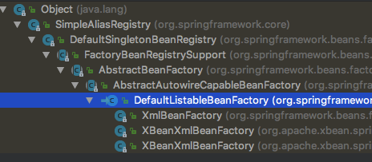
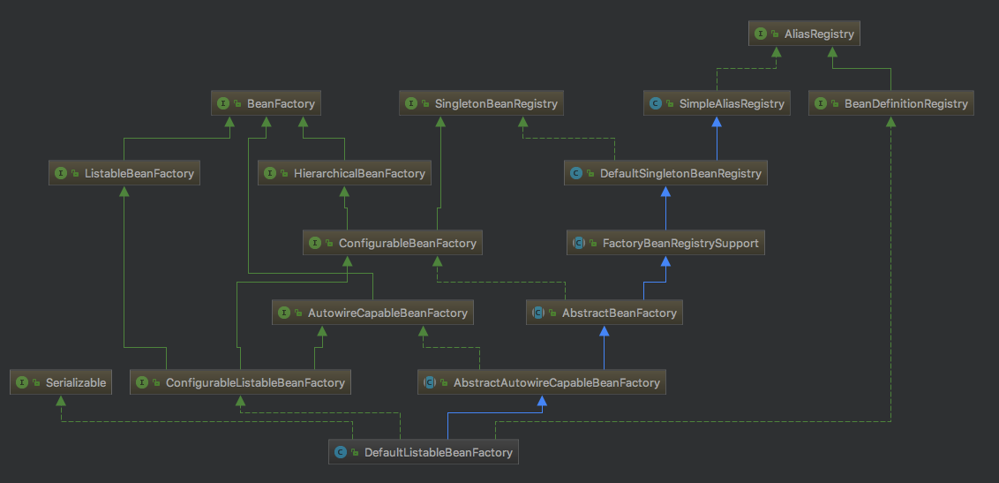

### spring 启动关键位置
[启动类具体分析--->refresh()](refresh.md)

#### BeanFactory 实现类
[BeanFactory具体分析](beanfactory.md)
#####  AbstractAutowireCapableBeanFactory 类中 实现 doCreateBean()
[(类)AbstractBeanFactory ->doGetBean -> (类)AbstractAutowireCapableBeanFactory -> doCreateBean](createbean.md)


#### beanfactory 实现关键类 关键类
```java
public class DefaultListableBeanFactory extends AbstractAutowireCapableBeanFactory 
                                        implements ConfigurableListableBeanFactory, BeanDefinitionRegistry, Serializable {
}
```

#### 类定义前，定义后  对bean 的处理
```java
public interface BeanPostProcessor {
    @Nullable
    default Object postProcessBeforeInitialization(Object bean, String beanName) throws BeansException {
        return bean;
    }

    @Nullable
    default Object postProcessAfterInitialization(Object bean, String beanName) throws BeansException {
        return bean;
    }
}
```

#### 注册类自定义时候，可以修改注册信息
```java
@FunctionalInterface
public interface BeanFactoryPostProcessor {
    void postProcessBeanFactory(ConfigurableListableBeanFactory var1) throws BeansException;
}
```

#### 自定注册
```java
public interface BeanDefinitionRegistryPostProcessor extends BeanFactoryPostProcessor {
    void postProcessBeanDefinitionRegistry(BeanDefinitionRegistry var1) throws BeansException;
}
/**
# 可以扫描包注册类  可参考mybatis  org.mybatis.spring.mapper.MapperScannerConfigurer 类
public void postProcessBeanDefinitionRegistry(BeanDefinitionRegistry registry) throws BeansException {
        String basePackage = "com.tian.spring.analysis.dao";
        ClassPathBeanDefinitionScanner scanner = new ClassPathBeanDefinitionScanner(registry);
        scanner.scan(StringUtils.tokenizeToStringArray(basePackage, ConfigurableApplicationContext.CONFIG_LOCATION_DELIMITERS));
    }
*/

```

Spring 中 代码执行顺序
```text
## 处理 PostProcessorRegistrationDelegate 类中 

1、BeanDefinitionRegistryPostProcessor --> postProcessBeanDefinitionRegistry()
2、BeanFactoryPostProcessor  --> postProcessBeanFactory()
3、eanPostProcessor  --> postProcessBeforeInitialization() 
                    --> AbstractBeanFactory -> doGetBean() 实例化  
                    --> [执行各种aware接口(ApplicationContextAware、InitializingBean)]
                    --> postProcessAfterInitialization()
4、实现接：ApplicationListener<ContextRefreshedEvent>  --> onApplicationEvent()

```

## AbstractBeanFactory 中 -> doGetBean() 流程
```text
// 处理 获取bean 实例
sharedInstance = getSingleton(beanName, () -> createBean(beanName, mbd, args));
AbstractAutowireCapableBeanFactory --> createBean() 
--> doCreateBean()【
--> 此方法中处理 :
--> createBeanInstance(beanName, mbd, args) --> instantiateBean() --> SimpleInstantiationStrategy类 --> instantiate()
--> populateBean(beanName, mbd, instanceWrapper) --> 处理注解 @AutoWare
--> exposedObject = initializeBean(beanName, exposedObject, mbd) -->applyBeanPostProcessorsBeforeInitialization()【Aware处理】 --> invokeInitMethods()【InitializingBean处理】 -->applyBeanPostProcessorsAfterInitialization()
】

```


##### defaultlistbeanfactory 类结构继承关系 



